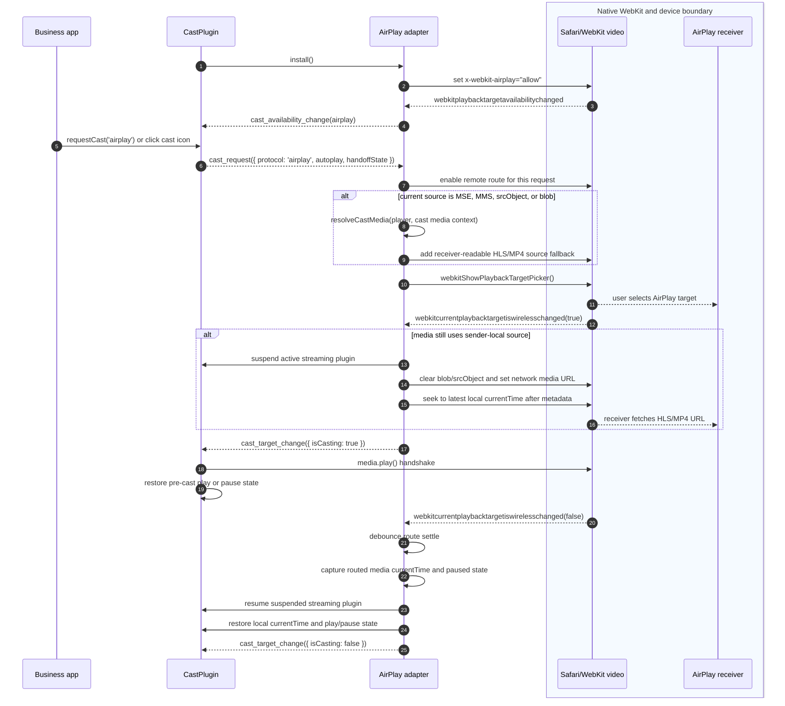

# xgplayer-cast

## Introduction


### Usage

```javascript
import Player from "xgplayer"
import CastPlugin from "xgplayer-cast"
import "xgplayer/dist/xgplayer.min.css"

const player = new Player({
    id,
    url,
    autoplay: true,
    plugins: [CastPlugin],
    cast: {
      showIcon: true,
      airplay: true,
      chromecast: true
    }
})
```

## Android / Chromecast Usage

```js
// Minimal — uses built-in default Sender SDK URL
const player = new Player({
  id,
  url,
  plugins: [CastPlugin],
  cast: {
    airplay: true,
    chromecast: true
  }
})

// Custom SDK URL (intranet, proxy, or self-hosted)
const player = new Player({
  id,
  url,
  plugins: [CastPlugin],
  cast: {
    chromecast: {
      sdkUrl: 'https://your-cdn.example.com/cast_sender.js',
      receiverApplicationId: 'YOUR_APP_ID',
      autoJoinPolicy: 'origin_scoped'
    }
  }
})
```

#### Config

| Name | Types | Default | Description |
| ------ | -------- | ----- | ----- |
| showIcon | boolean | `true` | Whether to display the cast icon in the control bar |
| airplay | boolean | `true` | Whether to enable Apple AirPlay when available |
| chromecast | boolean \| object | `true` | Enable Chromecast. `true` uses the default Sender SDK URL. Object form overrides SDK loading and session options. |
| chromecast.sdkUrl | string | Google Cast Sender SDK URL | Sender SDK URL. Defaults to the official Google Cast Sender SDK. Can be overridden for intranet/CDN/proxied deployments. |
| chromecast.sdkLoader | function | `null` | Custom async SDK loader. Use when the host app manages script loading. Receives no args, must return a Promise. |
| chromecast.receiverApplicationId | string | `''` | Receiver app id. Empty string means default media receiver. |
| chromecast.autoJoinPolicy | string | `'origin_scoped'` | Session auto join policy. |
| chromecast.loadSdkTimeout | number | `3000` | Sender SDK load timeout in milliseconds. |
| autoplayOnCast | boolean | inherit pre-cast state | Whether the receiver should start playing after casting starts. When omitted, the plugin preserves the play/pause state from the moment `requestCast()` is called: playing content keeps playing on the receiver, paused content stays paused. Set `true` or `false` to override. AirPlay may still issue an initial local play request to establish the route, then pause immediately when the resolved value is `false`; Chromecast maps the resolved value to `LoadRequest.autoplay`. |
| showAirplayMutedTip | boolean | `true` | Whether to show a tip prompting the user to unmute when AirPlay is connected |


### API

| Method Name | Description |
| ------ | ----- |
| requestCast(protocol?) | Programmatically open the native cast dialog (AirPlay picker or Chromecast device chooser). Pass `'airplay'` or `'chromecast'` to force a specific protocol; omit to auto-select the best available one. Has no effect if no cast protocol is available. |
| getCastRemoteState(protocol?) | Return the latest remote receiver state when the selected protocol exposes a remote controller. Currently Chromecast only. |
| controlCastRemote(action, payload?, protocol?) | Control the remote receiver when the selected protocol exposes a remote controller. Currently Chromecast supports `play`, `pause`, `toggle`, `seek`, `stop`, `setVolume`, `mute`, and `unmute`. |

### Events

| Event Name | Payload | Description |
| ------ | ----- | ----- |
| cast_error | `{ protocol, code, message, error?, media? }` | Emitted when Chromecast setup, session, media resolution, or remote media loading fails. |
| cast_remote_state_change | `{ protocol, available, connected, mediaLoaded, playerState, paused, currentTime, duration, volume, muted, title, contentId }` | Emitted by the Chromecast remote controller when CAF reports remote player state changes. |

### Chromecast Flow

The shaded area represents the native CAF and receiver boundary. Calls or events crossing that boundary are browser/device native APIs, native events, picker interactions, or receiver media actions.

```mermaid
sequenceDiagram
  autonumber
  participant App as Business app
  participant Plugin as CastPlugin
  participant Chromecast as Chromecast adapter
  box rgb(245, 250, 255) Native CAF and device boundary
    participant CAF as Google Cast Sender SDK
    participant Receiver as Chromecast receiver
  end

  Plugin->>Chromecast: install()
  Chromecast->>CAF: load sender SDK and CastContext.setOptions()
  Chromecast->>CAF: new RemotePlayerController()
  CAF-->>Chromecast: CAST_STATE_CHANGED
  Chromecast-->>Plugin: cast_availability_change(chromecast)

  App->>Plugin: requestCast('chromecast') or click cast icon
  Plugin-->>Chromecast: cast_request({ protocol, autoplay, handoffState })
  Chromecast->>CAF: CastContext.requestSession()
  CAF-->>Receiver: user selects device
  CAF-->>Chromecast: SESSION_STARTED or SESSION_RESUMED
  Chromecast-->>Plugin: cast_target_change({ isCasting: true })
  Chromecast->>Chromecast: resolveCastMedia(player, cast media context)
  Chromecast->>Chromecast: resolve autoplay from request payload
  Chromecast->>Chromecast: refresh local currentTime before receiver load
  Chromecast->>Plugin: pause local player before receiver load
  Chromecast->>CAF: session.loadMedia(LoadRequest(MediaInfo, autoplay, currentTime))
  opt receiver load fails
    Chromecast->>Plugin: resume local player
  end
  CAF-->>Receiver: load receiver-readable media URL
  CAF-->>Chromecast: RemotePlayerEventType.ANY_CHANGE
  Chromecast-->>Plugin: cast_remote_state_change(chromecast)

  opt local URL changes while casting
    Plugin-->>Chromecast: loadstart
    Chromecast->>Chromecast: reloadMedia(skipSameMedia, preserve remote play state; keep currentTime only when URL is unchanged)
    Chromecast->>CAF: session.loadMedia(new LoadRequest with remote state)
  end

  CAF-->>Chromecast: SESSION_ENDING
  Chromecast->>Chromecast: capture remote paused state and currentTime
  CAF-->>Chromecast: SESSION_ENDED or SESSION_START_FAILED
  Chromecast-->>Plugin: cast_target_change({ isCasting: false })
  opt session ended after receiver media
    Chromecast->>Plugin: restore local currentTime and play/pause state
  end
```

Chromecast runs on a separate receiver media session, not on the local `<video>` route. Before calling `session.loadMedia()`, the plugin pauses the local player so local streaming plugins do not keep decoding or playing while the receiver takes over. If receiver loading fails, the plugin resumes the local player when it was playing before the load attempt. Use `cast_target_change` to switch business UI into a casting state, `cast_remote_state_change` to render receiver state, and `controlCastRemote()` for remote play/pause/seek controls. Continuing to drive the local video element will only control local media.

Chromecast remote control is implemented with CAF `RemotePlayer` and `RemotePlayerController`. AirPlay does not expose the same independent receiver-control API, so AirPlay continues to use Safari/WebKit's native media element route.

### Chromecast Media Type

AirPlay and Chromecast share the same cast media resolver. Receiver-readable network URLs are resolved from `curDefinition.url`, the active streaming plugin's `core.config.url`, `config.url`, and media `<source>` elements, skipping `blob:`, `mediastream:`, `data:`, and `file:` URLs when a later network URL is available.

For signed or extensionless URLs, business code should provide an explicit `contentType`, `mimeType`, or `type`. The resolver uses this priority:

1. Object returned by `preProcessUrl`
2. Current definition item (`player.curDefinition`)
3. Selected source item in `url`
4. Top-level player config
5. URL extension fallback

Short aliases such as `hls`, `m3u8`, `dash`, `mpd`, and `mp4` are normalized to Cast receiver MIME types. Prefer full MIME values when possible: `application/x-mpegURL` for HLS, `application/dash+xml` for DASH, and `video/mp4` for MP4.

```js
// Recommended for definition lists
const player = new Player({
  id,
  definition: {
    list: [
      {
        definition: '720p',
        url: 'https://cdn.example.com/play?id=720',
        contentType: 'application/x-mpegURL'
      }
    ]
  },
  plugins: [CastPlugin],
  cast: { chromecast: true }
})
```

```js
// Recommended when the business layer signs or rewrites URLs
const player = new Player({
  id,
  url: 'https://cdn.example.com/play?id=main',
  contentType: 'application/x-mpegURL',
  preProcessUrl(url, ext) {
    if (ext?.scene === 'cast' && ext?.protocol === 'chromecast') {
      return {
        url: signForReceiver(url),
        contentType: 'application/x-mpegURL'
      }
    }
    return { url }
  },
  plugins: [CastPlugin],
  cast: { chromecast: true }
})
```

```js
// Source-array form is also supported
const player = new Player({
  id,
  url: [
    {
      src: 'https://cdn.example.com/play?id=main',
      type: 'application/x-mpegURL'
    }
  ],
  plugins: [CastPlugin],
  cast: { chromecast: true }
})
```

The resolver also forwards optional Cast `MediaInfo` fields including `contentUrl`, `streamType`, `duration`, `metadata`, `customData`, `hlsSegmentFormat`, and `hlsVideoSegmentFormat` when they are present on those same sources.

### AirPlay and MSE

AirPlay works best when Safari's native `<video>` element plays a receiver-readable HLS or MP4 URL directly. MSE and ManagedMediaSource create a sender-local media pipeline, often exposed as a `blob:` source or `srcObject`; AirPlay devices cannot fetch that local source from the sender page, which can result in local media continuing or the receiver playing audio only.

The shaded area represents the native Safari/WebKit and receiver boundary. Calls or events crossing that boundary are WebKit/HTML media APIs, native events, picker interactions, or receiver media actions.



When AirPlay is requested and the current media source is MSE, ManagedMediaSource, `srcObject`, or `blob:`, the plugin resolves the original network URL using the same source priority as Chromecast and adds a receiver-readable `<source>` fallback for WebKit/AirPlay before opening the native AirPlay picker. It does not suspend the active streaming plugin or replace the media element source just because the picker opened. After WebKit confirms that a wireless playback target was selected, the plugin clears the local MSE source, suspends the active streaming plugin, assigns the network URL to the media element, and seeks to the latest local `currentTime` after metadata is loaded.

The plugin enables the remote route at request time rather than during installation so it does not interfere with Safari ManagedMediaSource initialization in integrations that temporarily set `disableRemotePlayback`.

For business integrations, prefer one of these patterns:

1. On Safari/iOS where AirPlay is required, use native HLS whenever possible. This is the most reliable path because the media element already has a receiver-readable URL when the native picker opens.
2. Provide a direct HLS or MP4 URL in `url`, `definition.list[].url`, or `preProcessUrl`.
3. Avoid DRM, encrypted session-only URLs, `blob:`, `data:`, and localhost URLs for AirPlay media.
4. Provide an HLS variant that is broadly AirPlay-compatible, such as H.264/AAC with a conservative profile/level for the target receiver.
5. Keep captions in the HLS manifest if they need to appear on the AirPlay receiver.

### Cast Handoff

The cast plugin treats handoff as switching media ownership between local xgplayer and a receiver. `requestCast()` captures the local play/pause state; `autoplayOnCast` can override it. Chromecast refreshes local `currentTime` right before receiver load so device selection delay does not move the receiver back to an older point. Receiver media must still be a receiver-readable URL.

When returning from a receiver, the plugin restores local `currentTime` and play/pause state before emitting `cast_target_change({ isCasting: false })`. Business code can use that event to update UI after local state has been restored.

On iOS Safari, returning from AirPlay cannot guarantee automatic local play for audible media. The plugin restores the time point and tries `play()` once when the route was playing, but Safari may reject it because of autoplay policy. Business UI should handle the paused state and show the normal play affordance.

### Terminology

| Term | Scope | Meaning | Notes |
| ------ | ----- | ----- | ----- |
| Cast request | Cross-platform | A user or business-code action that asks the browser/device picker to start casting. | Triggered by the cast icon or `requestCast(protocol?)`. The request only starts protocol selection; it does not guarantee a remote target is connected. |
| CAF | Chromecast | Cast Application Framework, the high-level Google Cast SDK API exposed as `cast.framework`. | Web Sender integrations use CAF APIs such as `CastContext`, `RemotePlayer`, and `RemotePlayerController` to manage Cast sessions, receiver state, and remote controls. Lower-level media messages still use `chrome.cast.media.*`, such as `MediaInfo` and `LoadRequest`. |
| Handoff | Cross-platform | The media transition from the local xgplayer instance to a remote receiver. | This is the cross-protocol media-state layer. It captures receiver-readable media URL and play/pause intent at request time, then uses the latest available local time when the receiver takes over. |
| Handshake | Protocol-specific | A protocol-specific activation step required to establish a route or session. | This is an implementation detail, not the media-state contract. AirPlay may need a local `play()` call after the route becomes active, then pause again if the handoff state was paused. Chromecast uses `requestSession()` and `loadMedia()` instead. |
| Local media | Cross-platform | Media controlled by the sender page's local `<video>` element and local streaming plugins. | Chromecast pauses the local player before receiver load and resumes it if loading fails. For AirPlay, Safari/WebKit may continue routing the same media element to the receiver. |
| Remote media | Cross-platform | Media owned by the receiver device. | Chromecast exposes an independent remote media session through CAF `RemotePlayer`; AirPlay does not expose an equivalent receiver-control API and is driven through WebKit's media element route. |
| Receiver-readable URL | Business integration | A media URL that the receiver device can fetch directly. | `blob:`, `data:`, `file:`, `mediastream:`, localhost, DRM/session-bound, or sender-only URLs are not valid receiver media URLs. Business code can use `preProcessUrl` or `contentType` metadata to provide a receiver-compatible URL. |

### Notes

- AirPlay is available in xgplayer 3.0.25+.
- Chromecast is available in xgplayer 3.0.26+.
- **Encrypted video is not supported for casting**: AirPlay / Chromecast requires the receiver device (Apple TV, Chromecast dongle) to independently fetch and decrypt the media stream. DRM-protected content (FairPlay, Widevine, clearkeys, etc.) ties the decryption license to the current browser session, so the receiver cannot obtain a valid key and playback will fail.
