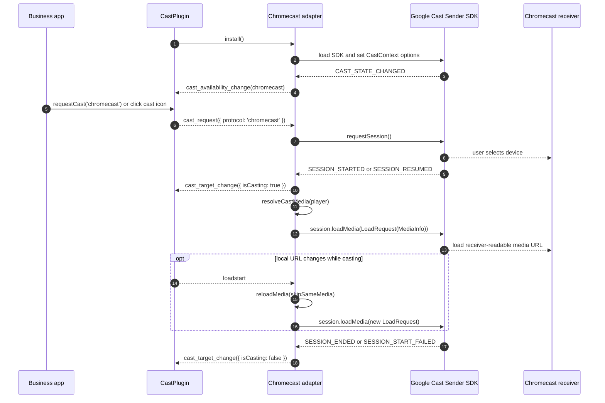
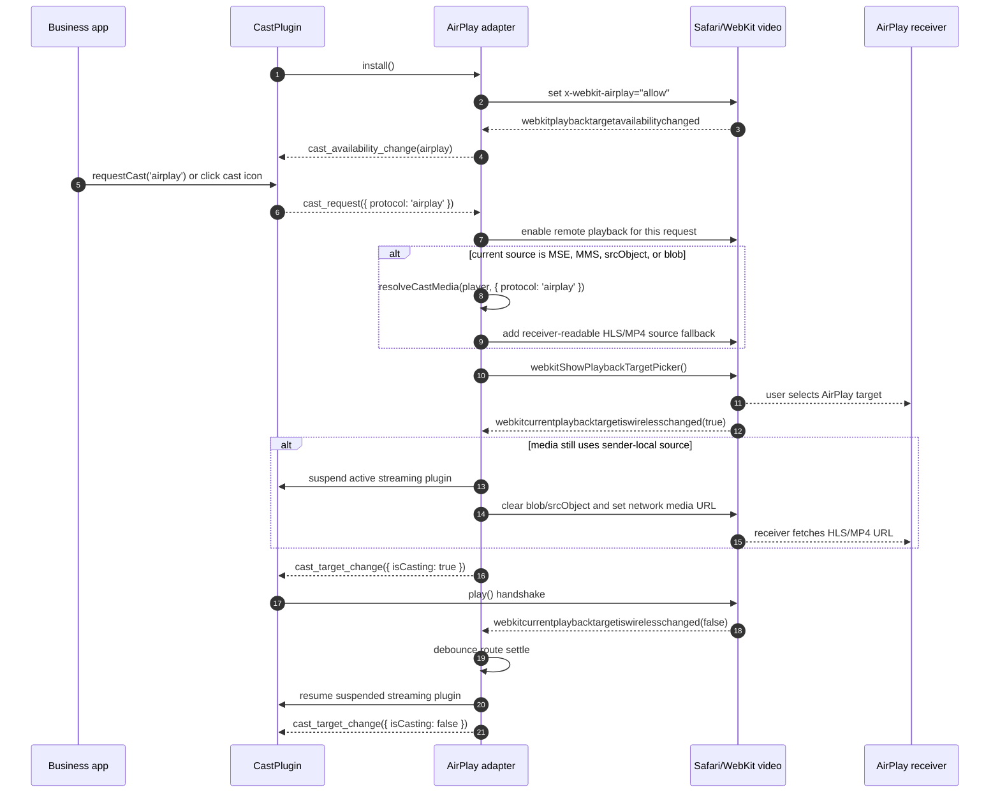

# xgplayer-cast

## Introduction


### Usage

```javascript
import Player from "xgplayer"
import CastPlugin from "xgplayer-cast"
import "xgplayer/dist/xgplayer.min.css"

const player = new Player({
    id,
    url,
    autoplay: true,
    plugins: [CastPlugin],
    cast: {
      showIcon: true,
      airplay: true,
      chromecast: true
    }
})
```

## Android / Chromecast Usage

```js
// Minimal — uses built-in default Sender SDK URL
const player = new Player({
  id,
  url,
  plugins: [CastPlugin],
  cast: {
    airplay: true,
    chromecast: true
  }
})

// Custom SDK URL (intranet, proxy, or self-hosted)
const player = new Player({
  id,
  url,
  plugins: [CastPlugin],
  cast: {
    chromecast: {
      sdkUrl: 'https://your-cdn.example.com/cast_sender.js',
      receiverApplicationId: 'YOUR_APP_ID',
      autoJoinPolicy: 'origin_scoped'
    }
  }
})
```

#### Config

| Name | Types | Default | Description |
| ------ | -------- | ----- | ----- |
| showIcon | boolean | `true` | Whether to display the cast icon in the control bar |
| airplay | boolean | `true` | Whether to enable Apple AirPlay when available |
| chromecast | boolean \| object | `true` | Enable Chromecast. `true` uses the default Sender SDK URL. Object form overrides SDK loading and session options. |
| chromecast.sdkUrl | string | Google Cast Sender SDK URL | Sender SDK URL. Defaults to the official Google Cast Sender SDK. Can be overridden for intranet/CDN/proxied deployments. |
| chromecast.sdkLoader | function | `null` | Custom async SDK loader. Use when the host app manages script loading. Receives no args, must return a Promise. |
| chromecast.receiverApplicationId | string | `''` | Receiver app id. Empty string means default media receiver. |
| chromecast.autoJoinPolicy | string | `'origin_scoped'` | Session auto join policy. |
| chromecast.loadSdkTimeout | number | `3000` | Sender SDK load timeout in milliseconds. |
| autoplayOnCast | boolean | `true` | Whether to keep playing after casting starts. AirPlay may still issue an initial local play request to establish the route, then pause immediately when set to `false`; Chromecast maps this value to `LoadRequest.autoplay`. |
| showAirplayMutedTip | boolean | `true` | Whether to show a tip prompting the user to unmute when AirPlay is connected |


### API

| Method Name | Description |
| ------ | ----- |
| requestCast(protocol?) | Programmatically open the native cast dialog (AirPlay picker or Chromecast device chooser). Pass `'airplay'` or `'chromecast'` to force a specific protocol; omit to auto-select the best available one. Has no effect if no cast protocol is available. |

### Events

| Event Name | Payload | Description |
| ------ | ----- | ----- |
| cast_error | `{ protocol, code, message, error?, media? }` | Emitted when Chromecast setup, session, media resolution, or remote media loading fails. |

### Chromecast Flow



### Chromecast Media Type

Chromecast requires a receiver-readable network URL and a MIME content type. The plugin resolves the URL from `curDefinition.url`, `player.url`, `config.url`, and media `<source>` elements, skipping `blob:`, `mediastream:`, `data:`, and `file:` URLs when a later network URL is available.

For signed or extensionless URLs, business code should provide an explicit `contentType`, `mimeType`, or `type`. The resolver uses this priority:

1. Object returned by `preProcessUrl`
2. Current definition item (`player.curDefinition`)
3. Selected source item in `url`
4. Top-level player config
5. URL extension fallback

Short aliases such as `hls`, `m3u8`, `dash`, `mpd`, and `mp4` are normalized to Cast receiver MIME types. Prefer full MIME values when possible: `application/x-mpegURL` for HLS, `application/dash+xml` for DASH, and `video/mp4` for MP4.

```js
// Recommended for definition lists
const player = new Player({
  id,
  definition: {
    list: [
      {
        definition: '720p',
        url: 'https://cdn.example.com/play?id=720',
        contentType: 'application/x-mpegURL'
      }
    ]
  },
  plugins: [CastPlugin],
  cast: { chromecast: true }
})
```

```js
// Recommended when the business layer signs or rewrites URLs
const player = new Player({
  id,
  url: 'https://cdn.example.com/play?id=main',
  contentType: 'application/x-mpegURL',
  preProcessUrl(url, ext) {
    if (ext?.scene === 'cast' && ext?.protocol === 'chromecast') {
      return {
        url: signForReceiver(url),
        contentType: 'application/x-mpegURL'
      }
    }
    return { url }
  },
  plugins: [CastPlugin],
  cast: { chromecast: true }
})
```

```js
// Source-array form is also supported
const player = new Player({
  id,
  url: [
    {
      src: 'https://cdn.example.com/play?id=main',
      type: 'application/x-mpegURL'
    }
  ],
  plugins: [CastPlugin],
  cast: { chromecast: true }
})
```

The resolver also forwards optional Cast `MediaInfo` fields including `contentUrl`, `streamType`, `duration`, `metadata`, `customData`, `hlsSegmentFormat`, and `hlsVideoSegmentFormat` when they are present on those same sources.

### AirPlay and MSE

AirPlay works best when Safari's native `<video>` element plays a receiver-readable HLS or MP4 URL directly. MSE and ManagedMediaSource playback create a sender-local media pipeline, often exposed as a `blob:` source or `srcObject`; AirPlay devices cannot fetch that local source from the sender page, which can result in local playback continuing or the receiver playing audio only.



When AirPlay is requested and the current media source is MSE, ManagedMediaSource, `srcObject`, or `blob:`, the plugin resolves the original network URL using the same source priority as Chromecast and adds a receiver-readable `<source>` fallback for WebKit/AirPlay before opening the native AirPlay picker. It does not suspend the active streaming plugin or replace the media element source just because the picker opened. After WebKit confirms that a wireless playback target was selected, the plugin clears the local MSE source, suspends the active streaming plugin, and assigns the network URL to the media element.

The plugin enables remote playback at request time rather than during installation so it does not interfere with Safari ManagedMediaSource initialization in integrations that temporarily set `disableRemotePlayback`.

For business integrations, prefer one of these patterns:

1. On Safari/iOS where AirPlay is required, use native HLS playback whenever possible. This is the most reliable path because the media element already has a receiver-readable URL when the native picker opens.
2. Provide a direct HLS or MP4 URL in `url`, `definition.list[].url`, or `preProcessUrl`.
3. Avoid DRM, encrypted session-only URLs, `blob:`, `data:`, and localhost URLs for AirPlay media.
4. Provide an HLS variant that is broadly AirPlay-compatible, such as H.264/AAC with a conservative profile/level for the target receiver.
5. Keep captions in the HLS manifest if they need to appear on the AirPlay receiver.

### Notes

- AirPlay is available in xgplayer 3.0.25+.
- Chromecast is available in xgplayer 3.0.26+.
- **Encrypted video is not supported for casting**: AirPlay / Chromecast requires the receiver device (Apple TV, Chromecast dongle) to independently fetch and decrypt the media stream. DRM-protected content (FairPlay, Widevine, clearkeys, etc.) ties the decryption license to the current browser session, so the receiver cannot obtain a valid key and playback will fail.
